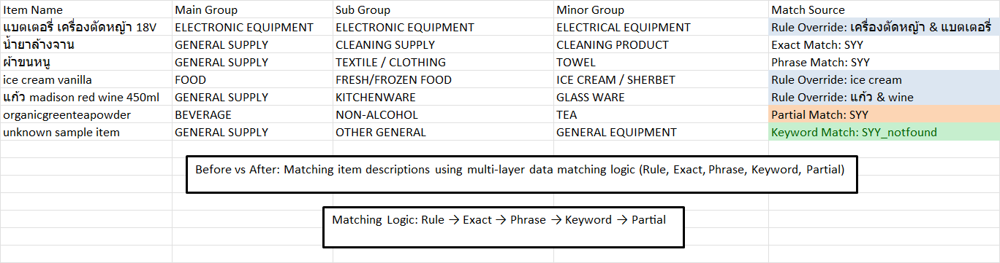

````markdown
# Item Matching Engine / Data Mapping System

Python-based item matching engine designed to standardize and classify inconsistent item descriptions using multi-layer matching logic.

---

## 🔍 Problem
Item descriptions across different systems are inconsistent (e.g., naming variations, prefixes, abbreviations), making it difficult to categorize and integrate data accurately.

---

## ⚙️ Solution
Developed a rule-based matching engine using Python to automatically match and classify item descriptions into standardized categories.  
The system applies multiple matching techniques in sequence to maximize accuracy and reduce incorrect matches.

---

## 🧠 Matching Logic
Rule → Exact → Phrase → Keyword → Partial

- Rule Override: Business-specific conditions for high-priority cases  
- Exact Match: Direct string match  
- Phrase Match: Matching similar phrases  
- Keyword Match: Matching based on shared keywords  
- Partial Match: Substring matching with scoring logic and threshold control  

---

## 🎯 Key Features
- Multi-layer matching strategy to improve accuracy  
- Rule-based override for complex business cases  
- Scoring system for conflict resolution  
- Handles unstructured and inconsistent data  
- Tracks match source for transparency  

---

## 📈 Impact
- Significantly reduced manual data matching effort  
- Improved consistency in item classification  
- Enabled scalable processing of large datasets  
- Increased reliability for downstream data analysis  

---

## 🛠️ Tools
Python, Pandas, Regex, Excel  

---

## 📂 Project Structure
match_snt.py  
sample_input.xlsx  
sample_output.xlsx  
screenshot.png  
README.md  

---

## ▶️ How to Use
1. Prepare input Excel file with required sheets:
   - Master SNT  
   - SYY  
   - SYY-Not Found  

2. Run the script:

```bash
python match_snt.py
````

3. Output file will be generated automatically

---

## 📸 Example Output



---

## 📌 Notes

This project uses sample data for demonstration purposes.
The logic reflects real-world data processing scenarios and can be adapted for production use.

```
